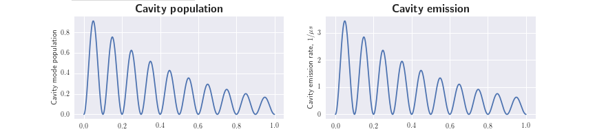
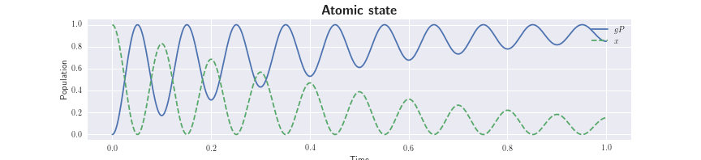
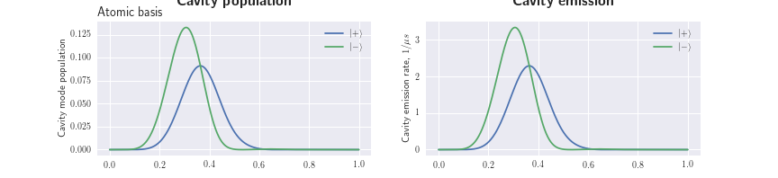
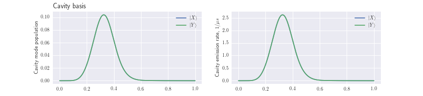
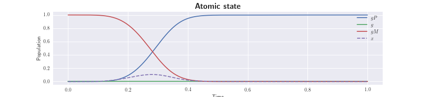

# rb-cqed

This repository contains the rb_cqed package for modelling cavity-QED.  This allows for easy simulations of coupled emitter-cavity system.


 

Beyond simple toy models, the focus is on the production of single photons from a single <sup>87</sup>Rb atom coupled to a cavity using a vacuum-stimulated Raman adiabatic passage (vSTIRAP) process on the D<sub>2</sub> line.

In particular these models includes a couple of effects - and supported the corresponding work - that have not been previously considered in such as system, namely:
- Nonlinear Zeeman effects that modify the energy levels and coupling strengths of the excited manifold of the D<sub>2</sub> line [1].
- Cavity birefringence, where the polarisation eigenmodes of the cavity are non-degenerate [2,3].

 

 

Also contained is a collection of IPython notebooks, supported by Mathematica notebooks, that both serve as a short introduction to the package, and examples of more detailed simulations.

##### References

[1] Barrett, T. D. et al., Nonlinear Zeeman effects in the cavity-enhanced emission of polarised photons, [New J. Phys **20**, 073030 (2018)](http://iopscience.iop.org/article/10.1088/1367-2630/aad14e).

[2] Barrett, T. D. et al., Polarisation oscillations in birefringent emitter-cavity systems, [Phys. Rev. Lett. **122**, 083602 (2019)](https://doi.org/10.1103/PhysRevLett.122.083602).

[3] Barrett, T. D. et al., Pushing Purcell-enhancement beyond its limits. [arxiv:1903.08628 (2019)](https://arxiv.org/abs/1903.08628).

## Installation

The models run on [QuTiP](http://qutip.org/).  Specifically the package was developed using version 4.3.1, and more recent versions may not be compatible.

To install rb_cqed locally, first you must prepare a suitable environment (this assumes you are using conda and have the appropriate conda-forge channel avaialble).

Minimum requirements:
```console
>>> conda create -n [env-name] python==3.6 qutip==4.3.1
```
Recommended requirements:
```console
>>> conda create -n [env-name] python==3.6 qutip==4.3.1 gcc jupyter nb_conda
```

Then download and install the [rb_cqed](rb_cqed/) package from this repository.
```console
(env-name) >>> conda create pip install [path ro rb_cqed]
```

The test scripts can then be used to
```console
(env-name) >>> import rb_cqed.testing as rt
(env-name) >>> rt.run()
```

## Repository contents

#### [Jupyter notebooks](jupyter_notebooks/)

###### [Demos (Docs)](jupyter_notebooks/rb_cqed_demos/)

Demonstration notebooks showing the basic functionality of rb_cqed.  *Learn by doing - these serve as the documentation!*

###### [Single simulations](jupyter_notebooks/notebooks-single)

_The notebooks in [Single](notebooks-single/) provide the gritty details of the code for simulating these systems.  They are not the easiest or recommended way to run the models.  Instead, the object oriented approach demonstrated in [notebooks-runner-demos](notebooks-runner-demos/) is recommended._

The IPython notebooks in [jupyter_notebooks/notebooks-single](jupyter_notebooks/notebooks-single/) contain considerable overlap with one another and can best be thought of as multiple versions of the same notebook, tailored towards modelling variations of our atom-cavity system.  Although specific functionality is included in only some of the notebooks (i.e. where I think it is most useful), it is a straightforward task to mix-and-match this for a custom model that you might be interested in.

- [vStirap-zeeman-scheme.ipyn](jupyter_notebooks/notebooks-single/py-pulses/vStirap-zeeman-scheme.ipynb) - For models that use all (or any subset) of the excited manifold and only the ground F=1,m_F={0,+/-1} sublevels.  As driving tranistions between these magentic sublevels often reuqires an external field to lift their degeneracy, nonlinear Zeeman effects are included along with cavity birefringence effects.

- [vStirap-hyperfine-scheme.ipyn](jupyter_notebooks/notebooks-single/py-pulses/vStirap-hyperfine-scheme.ipynb) - For models that use all (or any subset) of both the excited and ground state manifolds.  Nonlinear Zeeman effects are included as above, however as all atomic levels can, in principle, be included in the model cavity birefringence effects are neglected in order that the dimension of our modelled Hilbert space does not get too unwieldy.  Additionally this notebook contains some examples of driving two-laser STIRAP transitions, where the cavity coupling is not required, to prepare or repump the atom in the desired state.  Some simple analysis of the system evolution for many emission+rempumping cycles is also included.

There are additionally notebooks serving some of the same functionality in [c-pulses](jupyter_notebooks/notebooks-single/c-pulses) folder.  As the name suggests, these allow the laser pulses to be given as C functions, greatly increasing the speed of the simulations for certain pulse shapes.

#### [Mathematica notebooks](mathematica)

The notebooks in the [mathematica](mathematica) folder are not required to run the above models, however they are used to support the model.  Specifically:

- [hamiltonian-derivation.nb](mathematica/hamiltonian-derivation.nb) - Details the derivation of the Hamiltonians used to model the system.  Hopefully this demystifies the relatively complex couplings hardcoded into the IPython notebooks!

- [87rb-d2-in-B-field.nb](mathematica/87rb-d2-in-B-field.nb) - Models the level structure and coupling strengths of the <sup>87</sup>Rb D<sub>2</sub> line in the presence of an exteral magnetic field.  This notebook produces the parameter files in the [params](rb_cqed/atom87rb_params) folder, which in turn are imported into the vStirap-xxx-scheme.ipyn notebooks to include nonlinear Zeeman effects.

- [cavity-parameters](mathematica/cavity-parameters.nb) - A simple helper notebook that calculates the cavity parameters used in our models (such as the linewidth and atom-cavity coupling rates) from physical parameters such as the cavity length, mirror curvatures and so on.  This is intendned to assist in choose physically realistic cavity parameters in the notebooks in which they are not derived.  

## Requirements

Other than standard libraries (numpy, matplotlib etc.) the IPython notebooks require the [QuTiP](http://qutip.org/) package, version 4.3.1.  An [environment.yml file](supplementary/environment.yml) is provided in the [supplementary](supplementary/) folder.

For Mathematica, [87rb-d2-in-B-field.nb](mathematica/87rb-d2-in-B-field.nb) requires the [Atomic Density Matrix (ADM)](http://rochesterscientific.com/ADM/) package.

#### Patch for QuTiP as of 05/09/2018

_Please note, the below is my speculation, I don't pretend to know the QuTiP package in detail, but for what it is worth..._

As of QuTiP 4.3.1 I believe there is an issue with the [rhs_generate](https://github.com/qutip/qutip/blob/master/qutip/rhs_generate.py) function, which my notebooks use to generate the cython file for simulating the Hamiltonians.  The [mesolve](https://github.com/qutip/qutip/blob/master/qutip/mesolve.py) function seems to work as intended, however this is much slower when repeated simulating the same Hamiltonian with only changing variables.  After my own investigation I resolved the issue by changing lines 202-207  of [rhs_generate](https://github.com/qutip/qutip/blob/master/qutip/rhs_generate.py) from:
  ```  
   # add the constant part of the lagrangian
   if Lconst != 0:
       Ldata.append(Lconst.data.data)
       Linds.append(Lconst.data.indices)
       Lptrs.append(Lconst.data.indptr)
       Lcoeff.append("1.0")
   ```
   to
  ```  
   # add the constant part of the lagrangian
   if Lconst != 0:
       Ldata = [Lconst.data.data]+Ldata
       Linds = [Lconst.data.indices]+Linds
       Lptrs = [Lconst.data.indptr]+Lptrs
       Lcoeff = ["1.0"]+Lcoeff
   ```
If you have similar issues I suggest you try the above, or alternatively use the [rhs_generate.py](rb_cqed/qutip_patches/rhs_generate.py) that provided, where I have already made the change.